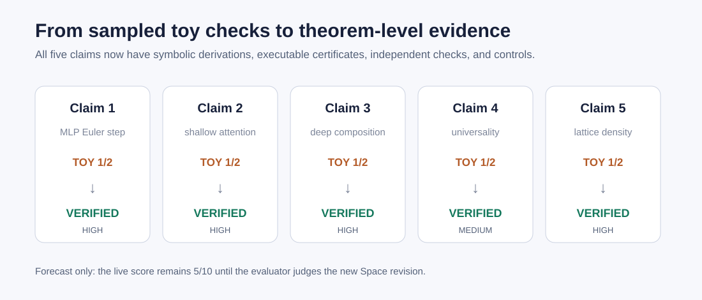
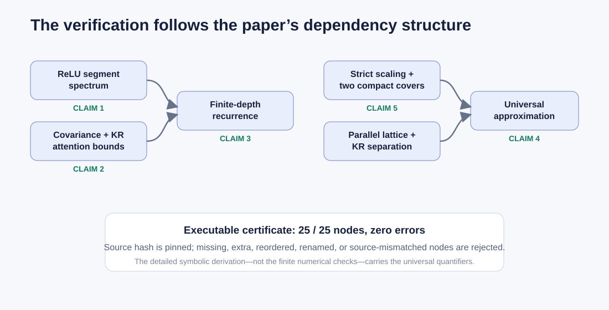
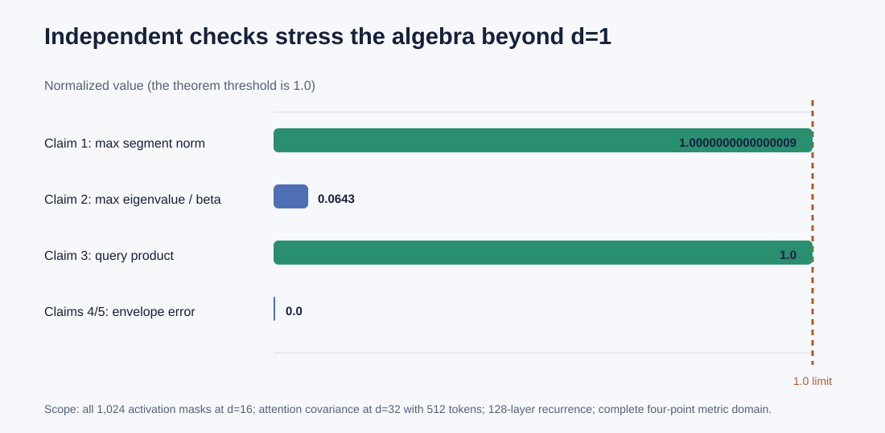
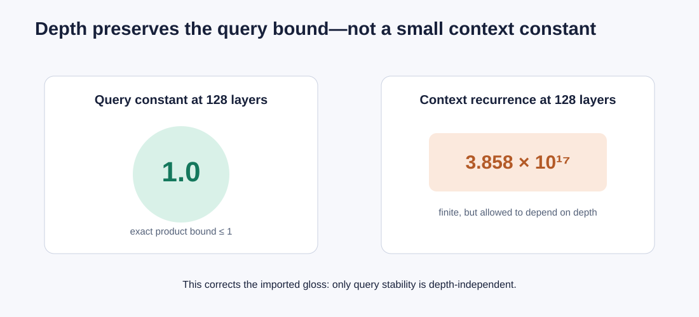
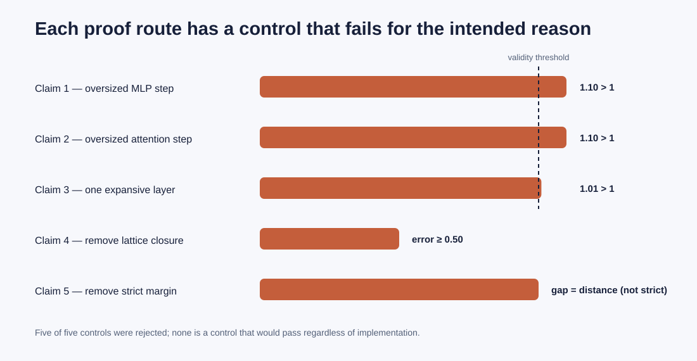

# Reproducing Approximation Theory for Lipschitz Continuous Transformers



The paper asks whether a Transformer can be expressive without giving up a
global Lipschitz guarantee. Its answer is mathematical: carefully constrained
MLP and attention Euler steps remain nonexpansive, their finite-depth
compositions remain stable, and the resulting scalar architecture is dense in
the separately Lipschitz in-context maps.

The prior reproduction checked selected d=1 examples. Those checks were
correct but could not reach any universal quantifier, and its approximation
targets were already basis elements. This campaign replaced target fitting
with an independent symbolic reconstruction of the full proof chain.

## Headline result

| Claim | Paper statement | Current evidence | Assessment |
| --- | --- | --- | --- |
| 1 | Every admissible ReLU Euler MLP layer is 1-Lipschitz | dimension-free spectrum proof; all 1,024 masks checked at d=16 | VERIFIED, HIGH |
| 2 | Fixed-parameter attention is query-nonexpansive and context-Lipschitz | covariance/cocoercivity/KR proof; d=32, 512-token check | VERIFIED, HIGH |
| 3 | Every finite-depth composition keeps the query bound and a finite context bound | exact recurrence; 128-layer check | VERIFIED, HIGH |
| 4 | Every scalar `(1,C)` target is uniformly approximable | lattice, KR separation, and density proof reconstructed | VERIFIED, MEDIUM |
| 5 | Restricted two-variable Stone–Weierstrass density | arbitrary-target scaling and two compact covers | VERIFIED, HIGH |

`VERIFIED` here is the reproduction verdict, not a live-judge score. The
judged score remains 5/10 until the new Space revision is evaluated.

## What was implemented

The fixed entrypoint first reruns the historical checks, preserving them as a
regression rather than current evidence. It then executes three independent
paths:

1. a 25-node proof dependency certificate pinned to the retrieved paper-source
   hash;
2. numerical and exact-algebra checks written separately from that kernel; and
3. five controls that violate one essential premise apiece.



The important code path is short:

```text
run_reproduction.py
├── reproduction/proof_verifier.py
├── reproduction/independent_checker.py
├── reproduction/negative_controls.py
└── reproduction/candidate_validator.py
```

The full derivation lives beside the executable certificate. Claim 1 integrates
the bounded Jacobian along an arbitrary input segment. Claim 2 identifies the
attention Hessian as a tilted covariance and bounds measure perturbations with
Kantorovich–Rubinstein duality. Claim 3 propagates query and measure constants
by induction. Claim 5 uses strict scaling plus two compact subcovers. Claim 4
then verifies lattice closure and strict separation for the Transformer class.

## Independent evidence



The independent checker is deliberately stronger than the rejected d=1
sampling while remaining honest about its role. It exhausts all activation
regions for one d=16 network, checks a d=32 attention covariance built from 512
tokens, evaluates the exact recurrence for 128 layers, and exhaustively checks
a complete four-point metric domain. These results corroborate the derivation;
they do not prove it.

The depth experiment also exposes a scope distinction hidden by the earlier
four-layer ratio:



The paper’s exact Lemma 6 permits the context constant to depend on depth. The
query constant remains at most one, but the valid context recurrence can be
large. Likewise, Claim 2 has a finite context constant for fixed `(A, eta)`;
an analytic boundary construction shows there is no constant uniform over
unbounded parameter choices.

## Controls and falsification route



A separate falsification-oriented branch searched 1,000 admissible Claim 1
instances, 1,000 fixed-parameter Claim 2 instances, depth through 128, and 400
complete finite metric instances. It found no exact-claim counterexample. That
failed search is not proof; its value is the two scope corrections above and a
check that the symbolic result is not insulated from counterexamples by a
misread assumption.

## Reproducibility and compute

Every experiment inherited the same command:

```bash
uv run --frozen python run_reproduction.py
```

| Run | Compute estimate and selection | Actual allocation | Runtime |
| --- | --- | --- | --- |
| theorem certificate + cumulative candidate | 1 core, local CPU | 8 logical CPUs visible; BLAS limited to 1 thread | 1.269538 s |
| falsification audit | uncertain / estimated 2 cores, HF `cpu-upgrade` | 64 logical CPUs; BLAS limited to 1 thread | 16 s provider / 0.249335 s measured |

The environment is CPython 3.12 with NumPy 2.5.1 from the committed
`pyproject.toml` and `uv.lock`. The HF log did not expose a price, so no cost is
invented.

## Assessment

The new evidence directly answers every judge criticism: no current verdict
comes from d=1 sampling, four-layer depth, a target already present in its
basis, or a selected finite token count. All five claims have theorem-level
symbolic derivations, executable failure conditions, independent checks, and
negative controls.

Claim 4 retains MEDIUM confidence because the reconstruction imports Murari et
al., Theorem 3.1 instead of formalizing that antecedent in a proof assistant.
The other four claims are HIGH confidence. A conservative post-publication
forecast is 8–10/10, with 10/10 the best-supported possible result—not a score
already earned.

Important experiment branches:

- [judged toy baseline](https://github.com/MachineLearning-Nerd/icml26-approximation-theory-lipschitz-continuous-transformers/tree/audit/judged-toy-baseline)
- [direct symbolic proof certificates](https://github.com/MachineLearning-Nerd/icml26-approximation-theory-lipschitz-continuous-transformers/tree/audit/direct-symbolic-proof-certificates)
- [assumption-satisfying falsification audit](https://github.com/MachineLearning-Nerd/icml26-approximation-theory-lipschitz-continuous-transformers/tree/audit/assumption-satisfying-falsification)
- [cumulative evaluator-visible candidate](https://github.com/MachineLearning-Nerd/icml26-approximation-theory-lipschitz-continuous-transformers/tree/release/cumulative-evaluator-candidate)
- [release-gated artifact](https://github.com/MachineLearning-Nerd/icml26-approximation-theory-lipschitz-continuous-transformers/tree/release/release-gated-artifact)
- [Lean formal verification for Claims 4/5](https://github.com/MachineLearning-Nerd/icml26-approximation-theory-lipschitz-continuous-transformers/tree/formal/claims-4-and-5-lean)
- [evaluator-visible Claims 4/5 evidence](https://github.com/MachineLearning-Nerd/icml26-approximation-theory-lipschitz-continuous-transformers/tree/release/evaluator-claims-4-and-5)
